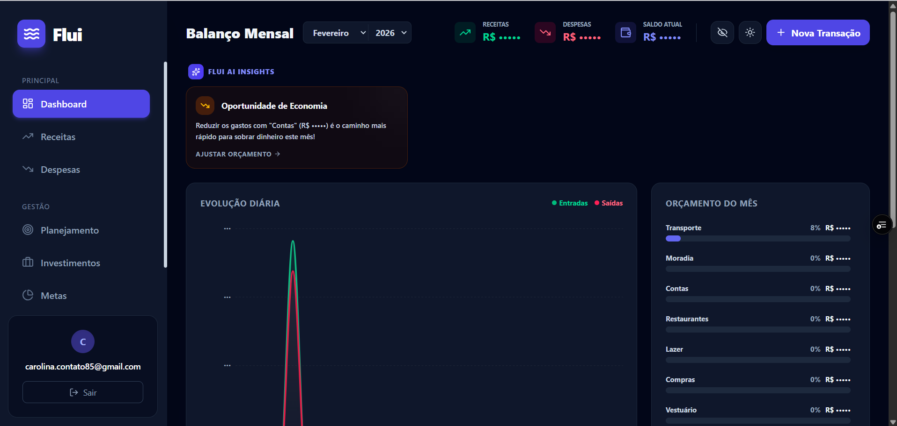

# 🌊 Flui | Gestão Financeira Inteligente

O **Flui** é um SaaS (Software as a Service) de gestão financeira pessoal construído para ir além da simples anotação de gastos. Ele oferece controle de orçamentos, inteligência artificial para insights de economia, gestão avançada de faturas de cartão de crédito e acompanhamento de investimentos.

🌐 **Acesse o projeto online (Live Demo):** [Flui no Vercel](https://finance-saas-swart.vercel.app)

---

## ✨ Principais Funcionalidades

- **📊 Dashboard Interativo:** Resumo do mês atual com gráficos de evolução diária (área), uso do orçamento (donut) e top categorias (barras).
- **🤖 Flui AI Insights:** Assistente inteligente que analisa as transações e avisa sobre sobregastos, oportunidades de economia ou dinheiro ocioso na conta.
- **💳 Motor de Cartão de Crédito:** Cartões com visual neumórfico. O sistema calcula automaticamente os dias de fechamento/vencimento, exibe a barra de uso de limite (com alertas de perigo) e permite zerar a fatura com o botão "Pagar Fatura".
- **🔄 Débito vs Crédito:** Ao lançar uma despesa e selecionar um cartão, escolha se a compra entra na fatura futura ou se já foi paga na hora.
- **🎯 Planejamento de Metas:** Matriz de planejamento mensal prevendo receitas e limitando despesas, com acompanhamento do "Realizado vs Planejado".
- **📈 Investimentos:** Carteira de ativos integrada com a API Brapi para atualização de preços em tempo real, calculando rentabilidade e grau de independência financeira.
- **🔒 Privacidade e UX:** - **Modo Olhinho (Privacidade):** Oculte todos os valores sensíveis com um clique (sincronizado em todas as telas via `localStorage`).
  - **Dark Mode / Light Mode:** Suporte nativo e fluido a temas.
  - **Design Premium:** Efeitos de glassmorphism, gradientes suaves e navegação instantânea.

---

## 🛠️ Tecnologias Utilizadas

- **Front-end:** [Next.js (App Router)](https://nextjs.org/) + [React](https://reactjs.org/)
- **Estilização:** [Tailwind CSS v4](https://tailwindcss.com/) + `next-themes`
- **Ícones:** [Lucide React](https://lucide.dev/)
- **Gráficos:** [Recharts](https://recharts.org/)
- **Notificações:** [Sonner](https://sonner.emilkowal.ski/)
- **Back-end & Auth:** [Supabase](https://supabase.com/) (PostgreSQL, Autenticação com Email/Senha e Google)
- **Deploy:** [Vercel](https://vercel.com/)

---

## 💡 Sobre o Projeto

Este projeto foi desenvolvido com o intuito de aplicar conceitos avançados de engenharia Front-end e UX/UI Design focados em **Fintechs**. 

O principal desafio técnico foi criar uma aplicação altamente interativa e responsiva, garantindo que o estado da aplicação (como as faturas de cartão e o planejamento mensal) simulasse com precisão as regras de negócio de um aplicativo bancário real. Toda a arquitetura foi pensada para entregar uma navegação instantânea e uma experiência de usuário imersiva e de alto padrão (nível SaaS de produção).

---

## 📸 Telas do Sistema

*(Confira algumas telas do sistema em funcionamento, demonstrando a adaptação entre temas e funcionalidades).*

<b>Clique para expandir as imagens</b>

 
 
 
 

---

## 👨‍💻 Autora

Desenvolvido com 🩵 e muito suor por Carol Lemos/carolemosdev

© 2026 Flui. Todos os direitos reservados.
